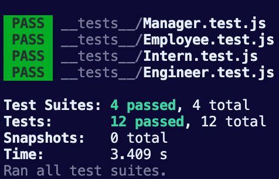

# Team Profile Generator

   

  ## Description
  This project is a Node.js command-line application that takes in information about employees on a software engineering team, then generates an HTML webpage that displays summaries for each person. 

  ## Table of Contents 
  - [Description](#description)
  - [Installation](#installation)
  - [Usage](#usage)
  - [Testing](#testing)
  - [Licensing](#licensing)
  - [Questions](#questions)

  ## Installation
   Below is an example of how you can download the project onto your own device:

  1. Open your devices terminal application
  2. Locate to the correct file destination that you are wanting to download this project to
  3. Clone the repository using this link: 
      ```md
          git clone https://github.com/squrpe/Team-Profile-Generator
      ```
  4. You may get prompted to input you github details, thus do so. Otherwise, the project will now be succesfully installed onto your device.

  This project contains:
  - Javascript
  - Node.js

  You will need to download the suitable extensions for Javascript and Node.js to run the application in the command line.

  ## Usage

Using node.js via the command line to prompt the main file, index.js to start running.

  Below is an example of the program:

  

  [You can also access the example video by clicking here](https://drive.google.com/file/d/1yZ85BHQwhjTje5LK8dEXj_yzmpYLQH97/view)

  To access the newly written HTML file, open the index.html in the ./dist folder. The fitting style.css is also located in that folder.


  ## Testing

Unit testing was used to create the minimum requirements this application needed to fulfill. Each testing suite goes through each class function and tests their specific methods.

To test the application, make sure you've previously ran the command:

    npm i
    

This is to install the necessary packages needed for the project. Then type and run the follow command:

    npm test
    
  
For the tests to be correctly working, the output should state that 4 test suites passed, pictured below:



  ## Licensing
This project is licensed under the MIT license.

  ## Questions:
  If you have any questions, contact me here:
  - Email: squrpe@example.com

  And if you want to see my additonal work, check out my Github:
  - Github: [squrpe](https://github.com/squrpe)


